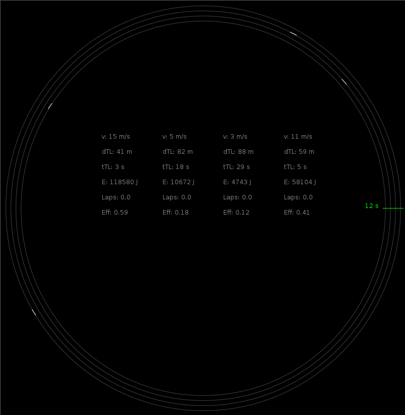

.. Copyright © 2014, 2016-2017 Martin Ueding <dev@martin-ueding.de>

########################
traffic-light-efficiency
########################

This simulates a four cars that drive on a circular road. There is one traffic
light that periodically changes between red and green. All the cars have
different policies regarding acceleration and deceleration. The number of laps
over the spent energy is shown in the middle.

Download
========

Compiled version: `<ampel.jar>`_
